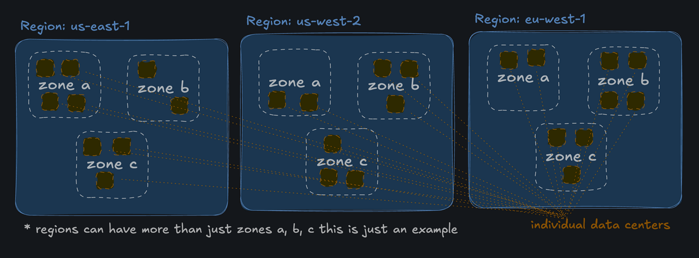

## Regions
- AWS offers its services in multiple regions around the world, allowing users to choose the region that best suits their needs.
- A region is a geographic location where AWS has data centers.
- Data centers are clustered into "availability zones"

> By default, your S3 bucket is replicated across multiple availability zones in a single region. That said, there are options to automatically replicate your bucket's data across multiple regions.

